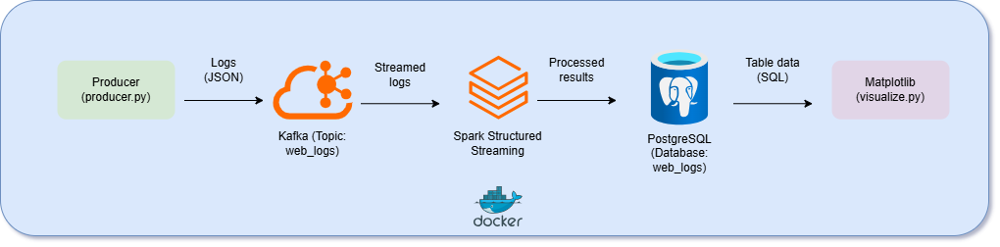

# Real-Time Log Pipeline

## Overview
This project is a real-time log analysis pipeline for an e-commerce platform, designed to process website logs, track user behavior, detect bots, and support business decisions. The pipeline leverages **Apache Kafka** for streaming, **Spark Structured Streaming** for processing, **PostgreSQL** for centralized storage, and **Matplotlib** for visualization, all deployed using **Docker**. This project demonstrates skills in big data processing, stream analytics, and database integration.

### Objectives
- **Track User Behavior**: Analyze product views and user actions (view, add to cart, checkout).
- **Support Decisions**: Provide actionable insights via SQL queries and visualizations.
- **Simulate Real Data**: Generate realistic e-commerce logs with bot activity.

## Architecture


The pipeline consists of:
- **Producer**: Generates realistic logs using `Faker` and sends to Kafka topic `web_logs`.
- **Kafka**: Streams logs to Spark with low latency.
- **Spark**: Processes logs in micro-batches (every 10 seconds), performing:
  - Product view counts (`product_views`).
  - Action ratios (`action_counts`).
- **PostgreSQL**: Stores results in tables, enabling efficient SQL queries.
- **Matplotlib**: Visualizes data with bar charts (top products, bot IPs), pie charts (action ratios), and line charts (payment errors).

## Technologies
- **Languages**: Python 3.8+
- **Streaming**: Apache Kafka 7.3.0, Spark Structured Streaming 3.5.0
- **Database**: PostgreSQL 15
- **Visualization**: Matplotlib, Seaborn, Pandas
- **Containerization**: Docker, Docker Compose
- **Dependencies**: Faker, SQLAlchemy, psycopg2-binary

## Prerequisites
- Docker and Docker Compose
- Python 3.8+
- Git
- 4GB RAM (for Docker containers)

## Setup Instructions
1. **Clone the repository**:
   ```bash
   git clone https://github.com/QuocKhanhhh/Real-Time-Log-Pipeline.git
   cd Real-Time-Log-Pipeline
   ```

2. **Start Docker services**:
   ```bash
   docker-compose up -d
   ```

3. **Create Kafka topic**:
   ```bash
   docker exec kafka kafka-topics.sh --create --topic web_logs --bootstrap-server kafka:9092 --partitions 6 --replication-factor 1
   ```

4. **Install Python dependencies** (for `visualize.py`):
   ```bash
   pip install -r requirements.txt
   ```

5. **Run Spark job**:
   ```bash
   docker cp spark_job.py spark-master:/opt/bitnami/spark/
   docker exec spark-master spark-submit --packages org.apache.spark:spark-sql-kafka-0-10_2.12:3.5.0,org.postgresql:postgresql:42.7.3 /opt/bitnami/spark/spark_job.py
   ```

6. **Generate visualizations**:
   ```bash
   python visualize.py
   ```

7. **Check PostgreSQL data**:
   ```bash
   docker exec -it shopeasy-pipeline-postgres-1 psql -U admin -d web_logs -c "SELECT * FROM product_views LIMIT 10;"
   ```

## Results
- **PostgreSQL Tables**:
  - `product_views`: Product view counts per 5-minute window.
  - `action_counts`: Action ratios (view, add to cart, checkout) per 5-minute window.

- **Visualizations** (in `output/`):
  - `product_views.png`: Bar chart of top 5 products by views.
  - `action_counts.png`: Pie chart of action ratios.
 
- **Sample Outputs**:
  - Top 5 Products: 
  - Action Ratios: 


## Challenges Overcome
- **Multiple CSV Files**: Replaced with PostgreSQL for centralized storage, simplifying data management and queries.
- **Schema Mismatch**: Fixed `action` vs. `actions` errors in Spark DataFrame (`spark_job.py`), ensuring data consistency.
- **Real-Time Processing**: Configured 10-second micro-batches for low-latency analytics.
- **Bot Detection**: Simulated bot behavior (IP `192.168.1.100`) with high request rates.

## Future Improvements
- Add real-time dashboards using Superset or Grafana.
- Scale Kafka partitions and Spark workers for larger datasets.
- Implement unit tests for Spark transformations and producer logic.
- Add monitoring with Prometheus for pipeline performance.


